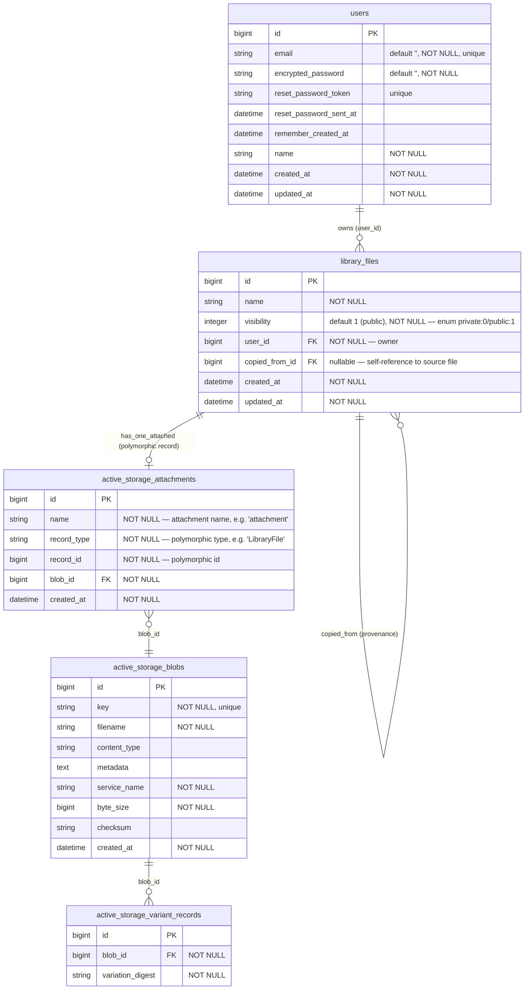

# ERD (Entity Relationship Diagram)

Generated from the **actual** database (`db/schema.rb`, schema version
`2026_07_20_094008`) and the models (`app/models/user.rb`,
`app/models/library_file.rb`). Columns and types are read verbatim from the
schema; relationships are read from the model associations and foreign keys.

## Notes on key decisions

- **Size and dates are derived from the blob, never duplicated.**
  `library_files` has no `byte_size`/`content_type` columns. `LibraryFile#byte_size`
  and `#content_type` read straight from the attached blob
  (`attachment.blob&.byte_size` / `&.content_type`), and file timestamps come from
  `active_storage_blobs.created_at`. The blob is the single source of truth for
  physical file facts, so metadata can never drift out of sync with the stored bytes.

- **Attachment is polymorphic and one-per-file.** `LibraryFile has_one_attached :attachment`,
  so each file row maps to at most one `active_storage_attachments` row. That join row is
  polymorphic (`record_type` + `record_id`); for library files `record_type = 'LibraryFile'`.
  Many attachments can point at one `active_storage_blobs` row (deduped content), and
  each blob can have many `active_storage_variant_records` (derived variants).

- **Visibility is an enum column, not scattered checks.** `visibility` is an integer enum
  (`private: 0`, `public: 1`, default `public`) declared on `LibraryFile`. Access decisions
  build on this single column plus the `authored_by?(actor)` helper (compares `user_id`),
  keeping authorization logic centralized on the model rather than duplicated in controllers
  or views. (The current model exposes `search_by_name` as its query scope; there is no
  `visible_to` scope in the code yet, despite the CLAUDE.md aspiration.)

- **`copied_from` records provenance via a self-reference.** `library_files.copied_from_id`
  is a nullable FK back to `library_files` (`belongs_to :copied_from, class_name: 'LibraryFile',
  optional: true`, with `has_many :copies`). A copied file points at its source; originals
  leave it `NULL`. Deleting a source uses `dependent: :nullify`, so copies survive and simply
  lose the back-link rather than being cascaded away.

- **Ownership.** `users` 1—N `library_files` through the non-null `user_id` FK
  (`User has_many :library_files, dependent: :destroy`); deleting a user removes their files.
